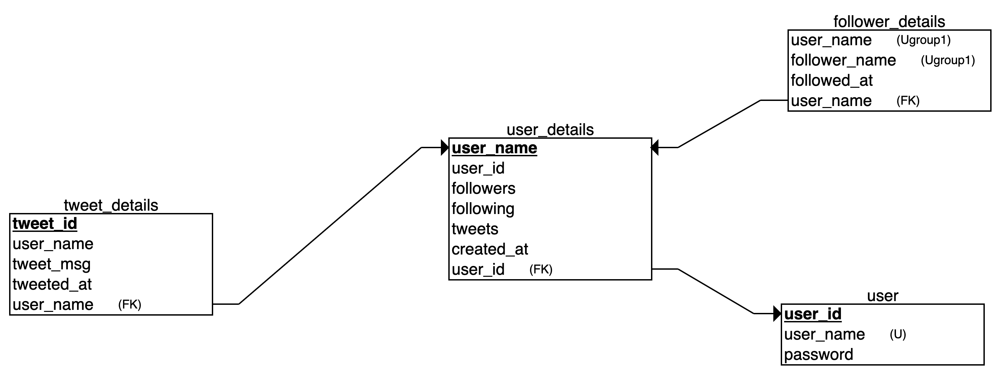

# Twitter

Below are the functionalities of twitter:
   -   A user should be able to sign up / login
   -   Users should be able to follow each other
   -   User should be able to tweet about anything they like
   -   When a user comes on their homepage, they should see all the tweets of people they are following sorted by latest tweet on top

## Installation

Please install the attached requirements.txt file before running the program.

```bash
pip install -r requirements.txt
```

## Running
##### Pleas check the pg connection config in /src/conf/pg_conf.py before running
# 
```bash
python app.py
open http://0.0.0.0:5000/
```

# Answer to Question
1. What technologies would you use to build out this platform? Please tell us the languages, databases, tools servers you would use to build out the above platform.
   - Python + Flask for the backend coding
   - Redis for caching the user session data for enhanced login experience
   - Postgres for storing the complete data
   - RabbitMQ for performing the background task like increasing the count of tweet, followers, following etc.
2. Write the schema of your database that is going to store the data. We want to see this in detail to see where the all the different information will be stored
   - 
3. How much can the system you have built scale up to? What are the limiting factors of your system and when will it start failing?
   - The ideal number of concurrent PG connection is 100 so it can serve 100 users at a time.
   - The main limiting factor would be concuurent PG connection when more number of users are logged in at same time and query the data base. To overcome this challege either we can cache the recent tweets depending upon the user or else we can create per user schema and maintain different pg pools.

## ToDo
Below are the things I wised to do but due to time constraints I am not able to do:
- UTs
- Retry logic in all post requests
- Making the post_tweet, increasing counts for tweet, followers and following a celery task.
- User session caching in Redis with ttl logic for faster login experience
- 1 database with global users table and per user schema
